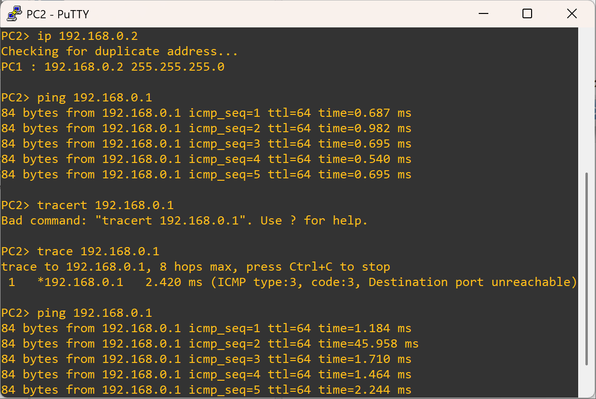
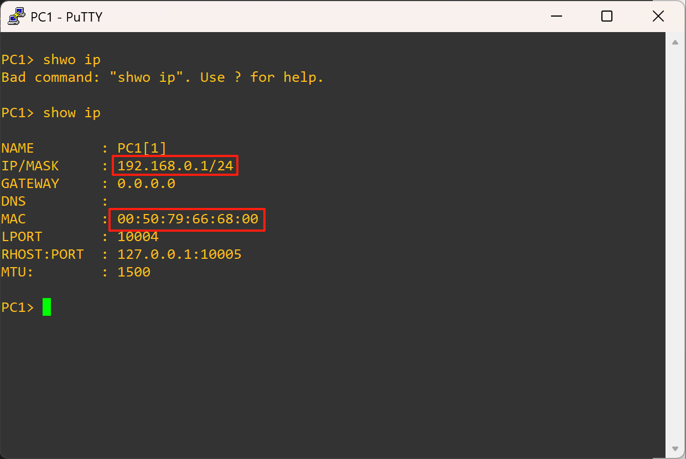
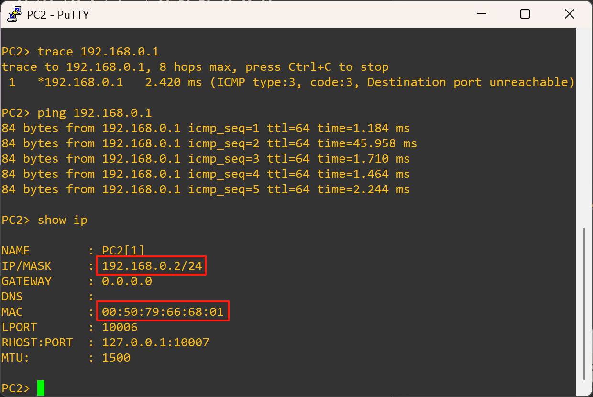
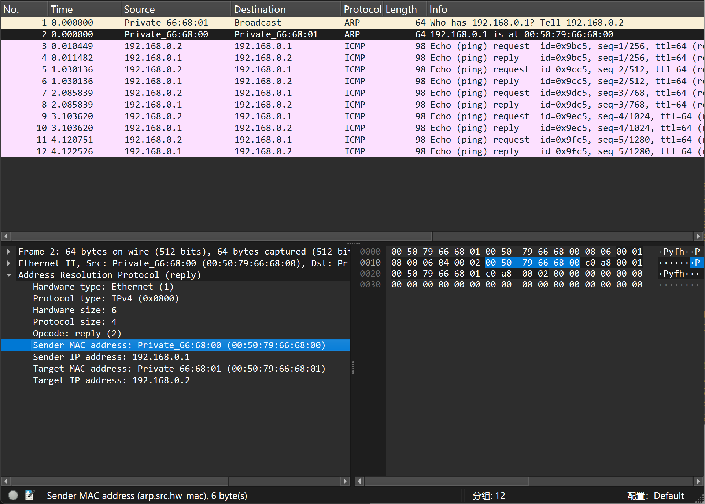
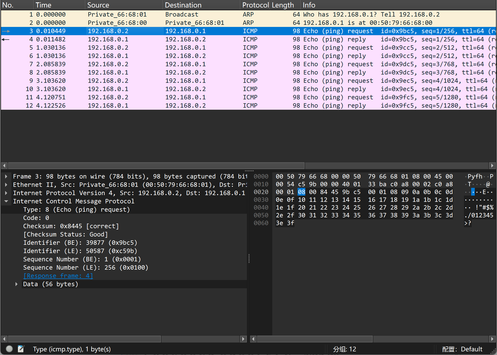
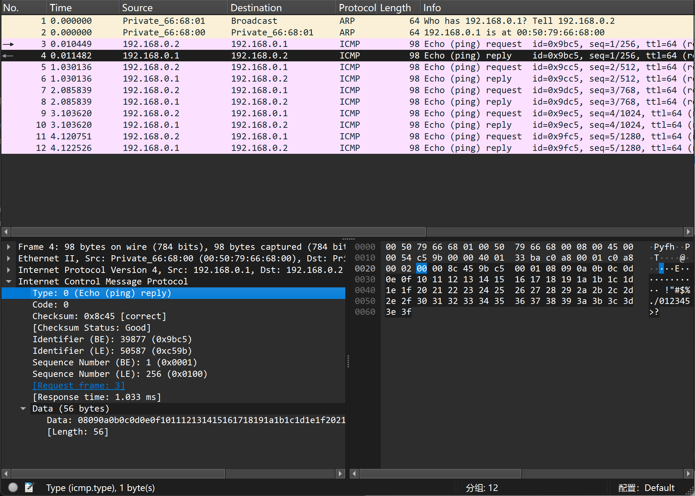
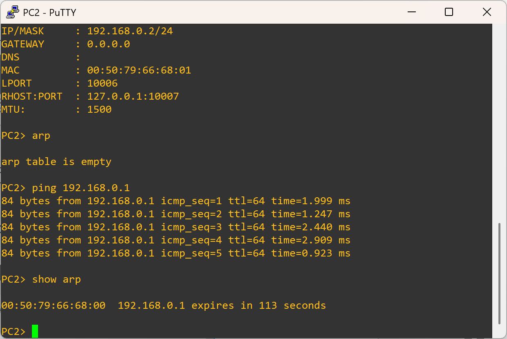
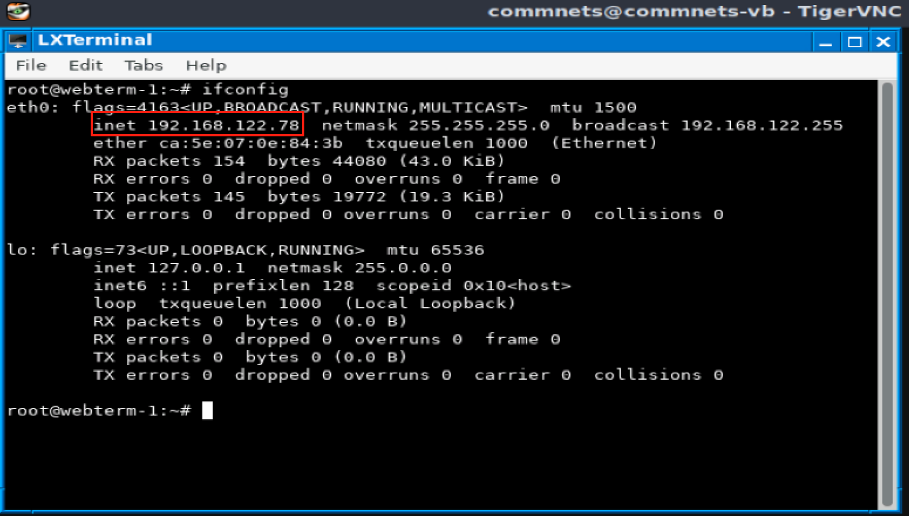
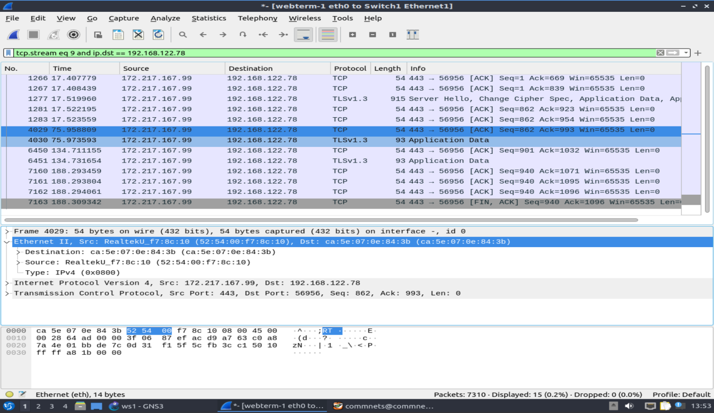

# ELEN90061 Communication Systems

## Part I

> Question 1.1. Reflect on IP vs MAC addresses. What is the difference? Did you assign a MAC address to the VPCSs in the emulation? Where do they come from?

> Question 1.2. How does the switch know where to send the packages? Would it be able to manage it if you had connected 3 or 4 VPCSs to the switch? If yes, how?

> Question 2.1. Which protocols do you observe in Wireshark during ping? Focusing on ping packets, which layers do you see in action? What does Wireshark tell us about them? Can you identify, for example, the MAC layer and find the MAC addresses? Which fundamental characteristics of the layered architecture do you observe in action? Elaborate based on what you have learned in lectures.

> Question 2.2. Now focus on ARP protocol and tables. What do you observe about ARP? Comment on how it works. Discuss based on what you have learned in lectures and what you find on the internet, e.g., [https://en.wikipedia.org/wiki/Address_Resolution_Protocol](https://en.wikipedia.org/wiki/Address_Resolution_Protocol)

## Part II

## Part III

