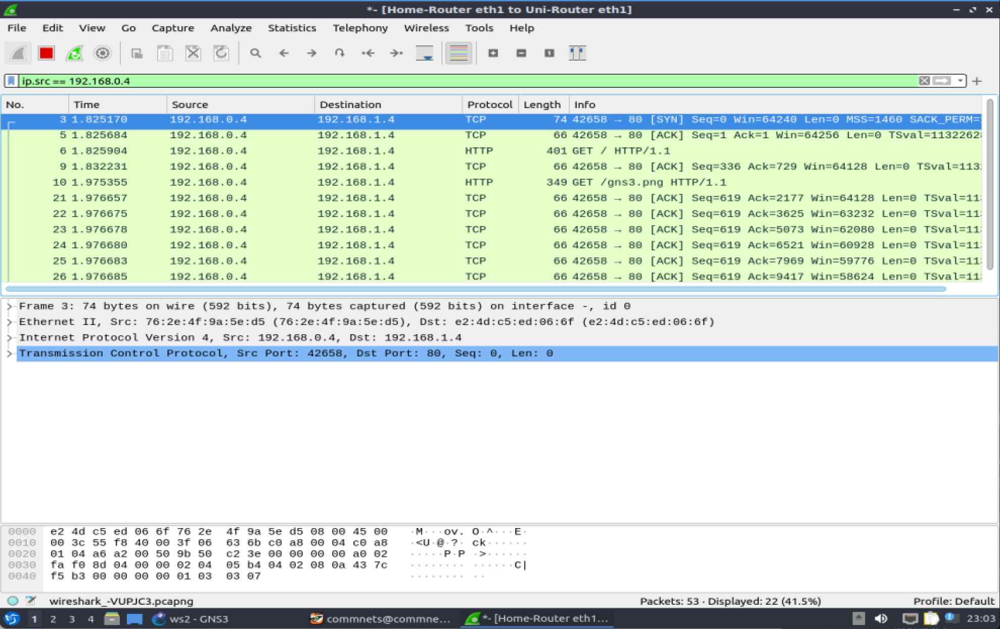

# ELEN90061 Workshop 2





---
---

## 🧠 socket() 函数的基本结构

在 Python 中创建套接字的语法如下：

```python
socket.socket(family, type)
```

- **family（套接字族）**：指定地址类型，最常用的是：
  - `AF_INET`：用于 IPv4 网络通信；
  - `AF_INET6`：用于 IPv6；
  - `AF_UNIX`：用于本地 UNIX 域套接字。

- **type（套接字类型）**：指定通信方式，最常见的是：
  - `SOCK_STREAM`：基于 TCP，面向连接；
  - `SOCK_DGRAM`：基于 UDP，无连接、面向数据报。

---

## 🔍 SOCK_STREAM vs SOCK_DGRAM 的区别

| 特性 | SOCK_STREAM (TCP) | SOCK_DGRAM (UDP) |
|------|-------------------|------------------|
| 协议类型 | TCP | UDP |
| 是否连接 | 面向连接 | 无连接 |
| 数据可靠性 | 高，保证顺序和完整性 | 低，可能丢包或乱序 |
| 适用场景 | 文件传输、网页访问、聊天应用 | 视频流、语音通话、DNS 查询 |
| 是否确认 | 有确认机制 | 无确认机制 |
| 编程复杂度 | 较高，需要连接管理 | 较低，发送即走 |

---

## 📦 应用场景选择

- 使用 `SOCK_STREAM`（TCP）：
  - 当你需要**可靠传输**，如聊天程序、文件下载、网页浏览；
  - 例如你在 Workshop 中实现的 **客户端与服务器之间的消息传递**，就使用了 TCP 套接字。

- 使用 `SOCK_DGRAM`（UDP）：
  - 当你需要**快速传输**，可以容忍部分数据丢失；
  - 适合实时应用，如音视频流、在线游戏、广播消息。

---

### 📚 讲义中的实践任务

在 Workshop 的 Socket 编程部分，你会：

- 使用 `AF_INET` 和 `SOCK_STREAM` 创建 TCP 套接字；
- 编写客户端和服务器程序，实现消息发送与接收；
- 使用 `socket.bind()`、`socket.listen()`、`socket.accept()` 等函数构建连接；
- 如果你尝试使用 UDP，还会用到 `socket.sendto()` 和 `socket.recvfrom()`。

---

### ✅ 总结课程重点

> 在 `socket()` 函数中，**family 决定地址类型，type 决定通信方式**。根据你的应用需求选择 `SOCK_STREAM` 或 `SOCK_DGRAM`，是网络编程中的关键设计决策。

如果你想进一步比较 TCP 和 UDP 的性能差异，或者想扩展你的客户端程序支持两种模式，我可以帮你设计一个通用框架。我们可以让你的代码更灵活、更强大。

---
---

## 🧠 `socket.bind()` 的作用是什么？

在 Python 的 `socket` 模块中，`bind()` 函数用于将一个套接字（socket）**绑定到本地地址和端口**，使得该套接字可以监听来自该地址的连接或数据。

- 对于服务器来说，`bind()` 是必须的步骤，它告诉操作系统：“我想在这个 IP 地址和端口上接收数据。”
- 没有 `bind()`，服务器就无法知道在哪个接口上等待客户端连接。

---

## 📦 AF_INET 情况下的地址格式

当使用 `AF_INET`（IPv4）作为 socket family 时，地址参数必须是一个 **二元组 (host, port)**：

```python
socket.bind(("127.0.0.1", 50007))
```

- `host` 是字符串形式的 IP 地址，例如 `"127.0.0.1"` 或 `"0.0.0.0"`（表示所有本地接口）；
- `port` 是整数形式的端口号，例如 `50007`。

> ⚠ 注意：地址必须是元组形式，否则会报错（如讲义和 [官方文档](https://docs.python.org/3/library/socket.html) 所示）。

---

## 🧩 服务器、客户端是否使用 `bind()`？

- ✅ **服务器必须使用 `bind()`**：
  - 服务器需要明确在哪个地址和端口上监听连接；
  - 这是服务器初始化的关键步骤之一；
  - 讲义中的服务器代码就使用了 `bind()` 来绑定 `"0.0.0.0"` 和端口号。

- ❌ **客户端通常不需要使用 `bind()`**：
  - 客户端由操作系统自动分配临时端口；
  - 只需使用 `connect()` 指定服务器地址即可；
  - 除非你有特殊需求（如固定源端口），一般不调用 `bind()`。

---

### ✅ 总结课程重点

| 项目 | 内容 |
|------|------|
| `bind()` 作用 | 将 socket 绑定到本地地址和端口 |
| AF_INET 地址格式 | `(host, port)`，如 `("127.0.0.1", 50007)` |
| 使用场景 | **服务器必须使用**，客户端通常不需要 |

这部分内容是你构建客户端-服务器程序的基础。如果你想进一步理解 `bind()` 与 `listen()`、`accept()` 的关系，我可以帮你梳理一个完整的服务器初始化流程图。我们可以让你的网络程序逻辑更清晰、更健壮。

---
---

## 🛰️ 一、基于**无连接通信（connectionless）**的服务器：使用 UDP 协议

在这种模式下，服务器不需要建立连接，只需等待客户端发送数据报（datagram），然后处理即可。对应的 socket 类型是 `SOCK_DGRAM`。

### ✅ 所需函数：

| 函数 | 作用 |
|------|------|
| `socket.socket()` | 创建 UDP 套接字，参数为 `AF_INET, SOCK_DGRAM` |
| `socket.bind()` | 绑定本地地址和端口，使服务器可以接收数据 |
| `socket.recvfrom()` | 接收客户端发送的数据报，同时获取客户端地址 |
| `socket.sendto()` | 向指定客户端地址发送响应数据 |

### 📦 示例流程：

```python
import socket

server_socket = socket.socket(socket.AF_INET, socket.SOCK_DGRAM)
server_socket.bind(("0.0.0.0", 50007))

while True:
    data, client_addr = server_socket.recvfrom(1024)
    print("Received:", data.decode())
    server_socket.sendto(b"ACK", client_addr)
```

---

## 🔗 二、基于**面向连接通信（connection-oriented）**的服务器：使用 TCP 协议

这种模式下，服务器需要先建立连接，然后与客户端进行持续通信。对应的 socket 类型是 `SOCK_STREAM`。

### ✅ 所需函数：

| 函数 | 作用 |
|------|------|
| `socket.socket()` | 创建 TCP 套接字，参数为 `AF_INET, SOCK_STREAM` |
| `socket.bind()` | 绑定本地地址和端口 |
| `socket.listen()` | 开始监听连接请求 |
| `socket.accept()` | 接受客户端连接，返回新的 socket 和客户端地址 |
| `socket.recv()` | 接收客户端发送的数据 |
| `socket.sendall()` | 向客户端发送数据 |
| `socket.close()` | 关闭连接（可选，用于清理资源） |

### 📦 示例流程：

```python
import socket

server_socket = socket.socket(socket.AF_INET, socket.SOCK_STREAM)
server_socket.bind(("0.0.0.0", 50007))
server_socket.listen()

while True:
    conn, addr = server_socket.accept()
    data = conn.recv(1024)
    print("Received:", data.decode())
    conn.sendall(b"ACK")
    conn.close()
```

---

## 🧠 总结课程重点

| 模式 | 协议 | 典型用途 | 所需函数 |
|------|------|----------|-----------|
| 无连接 | UDP | 快速、轻量通信（如 DNS、视频流） | `socket()`, `bind()`, `recvfrom()`, `sendto()` |
| 面向连接 | TCP | 可靠通信（如网页、聊天） | `socket()`, `bind()`, `listen()`, `accept()`, `recv()`, `sendall()` |

讲义中通过实际编程任务让你体验这两种模式的差异，帮助你理解何时使用哪种通信方式。如果你想扩展服务器支持多客户端或非阻塞通信，我可以帮你引入 `select` 或 `threading` 模块来实现更复杂的架构。我们可以让你的网络程序更强大、更灵活。

---
---

## 🧠 什么是 Blocking 和 Non-blocking Socket？

### 🔒 Blocking Socket（阻塞套接字）

- 默认情况下，Python 中的 socket 是**阻塞模式**。
- 当你调用如 `recv()`、`accept()`、`connect()` 等函数时，如果操作无法立即完成，程序会**停在这一行，等待结果**。
- 举例：如果你调用 `recv()` 接收数据，但客户端还没发送，程序就会一直卡住，直到数据到达。

> 类似于打电话时被“请稍候”挂住，你不能做其他事，只能等。

---

### 🚀 Non-blocking Socket（非阻塞套接字）

- 非阻塞模式下，socket 操作**立即返回**，即使没有数据也不会等待。
- 如果你调用 `recv()` 而没有数据，它会抛出异常或返回空值，而不是卡住程序。
- 你可以通过 `socket.setblocking(False)` 或 `socket.setblocking(0)` 来设置非阻塞模式。

> 类似于打电话时没人接，你立刻挂断去做别的事。

---

## 📦 哪种模式在实践中更常用？

> ✅ **阻塞模式（Blocking）是最常用的**，尤其在简单的客户端-服务器程序中。

### 原因如下：

- 编程更简单，逻辑清晰；
- 适合教学和小型项目；
- Python 的 socket 默认就是阻塞模式，初学者更容易上手；
- 在讲义中你编写的客户端和服务器程序就是基于阻塞模式的。

### 非阻塞模式的应用：

- 更适合高并发或实时系统；
- 通常结合 `select`、`poll` 或 `asyncio` 等机制使用；
- 适用于需要同时处理多个连接的服务器（如聊天室、游戏服务器）。

---

## 🧩 总结课程重点

| 模式 | 行为 | 优点 | 缺点 | 应用场景 |
|------|------|------|------|----------|
| 阻塞 | 操作等待完成 | 简单易用 | 可能卡住程序 | 教学、简单服务 |
| 非阻塞 | 操作立即返回 | 高并发处理 | 编程复杂 | 实时系统、大型服务 |

如果你想将你的服务器程序改为非阻塞模式，我可以帮你引入 `select` 或 `asyncio` 来实现更高效的并发处理。我们可以让你的代码更专业、更强大。

---


